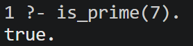
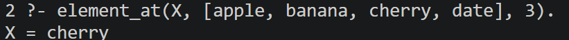
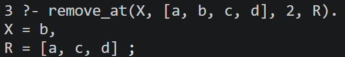
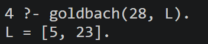
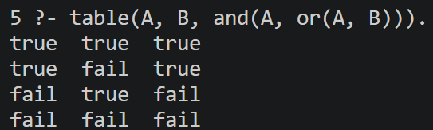

# Prolog-Fundamentals
🦉 Prolog logic programs implementing list manipulation, number theory algorithms, and boolean truth tables

## Table of Contents  

1. [About](#about)  
2. [Features](#features)  
3. [Requirements](#requirements)  
4. [Installation](#installation)  
5. [Usage](#usage)  

---

## About  

Prolog Fundamentals is a logic-based project focused on solving classical computational and mathematical problems. By utilizing the Declarative Programming paradigm, the project emphasizes the use of facts, rules, and logical inference to derive solutions, showcasing the elegance and power of SWI-Prolog.

---

## Features  

- **Element Extraction** – Finding the $n$-th element of a list using index-based retrieval.
- **Goldbach's Conjecture** – Proving that every even integer greater than 2 is the sum of two primes.
- **Primality Testing** – Efficiently determining whether a given number is prime.
- **List Manipulation** – Removing an element from a list at a specific position and returning the modified list.
- **Truth Tables** – Automated generation of truth tables for complex boolean expressions and logical operators.


---

## Requirements

- **SWI-Prolog** – The project is designed and tested on the SWI-Prolog environment (version 8.0 or higher recommended).
- **Git** – Required for cloning the repository to your local machine.

---

## Installation

Follow these steps to set up the project locally:

---

### 1. Clone the repository
```bash
git clone https://github.com/Amit-Bruhim/Prolog-Fundamentals.git
```
### 2. Navigate into the project folder
```bash
cd Prolog-Fundamentals
```

### 3. Load the project
Run the following command to start the SWI-Prolog interpreter and load all project modules at once:
```bash
swipl src/load.pl
```

---

## Usage  

After loading the project with `swipl src/load.pl`, the interpreter will stay open, allowing you to run queries. Simply type the query and end it with a period (`.`).

---

### 1. Primality Test
To check if a number is prime, use `is_prime(N)`, where **N** is the integer you want to test.  


### 2. Element at Index
To find an element at a specific position, use `element_at(X, List, Index)`. The element at that index will be unified with the variable **X**.  


### 3. Remove Element
To remove an element from a specific position, use `remove_at(X, List, Index, Result)`. The removed item will be stored in **X**, and the new list in **Result**.  


### 4. Goldbach's Conjecture
To find two prime numbers that sum up to an even integer, use `goldbach(N, L)`, where **N** is the even number and **L** will return the pair of primes.  


### 5. Truth Tables
To generate a truth table for a logical expression, use `table(A, B, Expression)`. The program will print all possible truth values for **A** and **B** and the result of the expression.  



